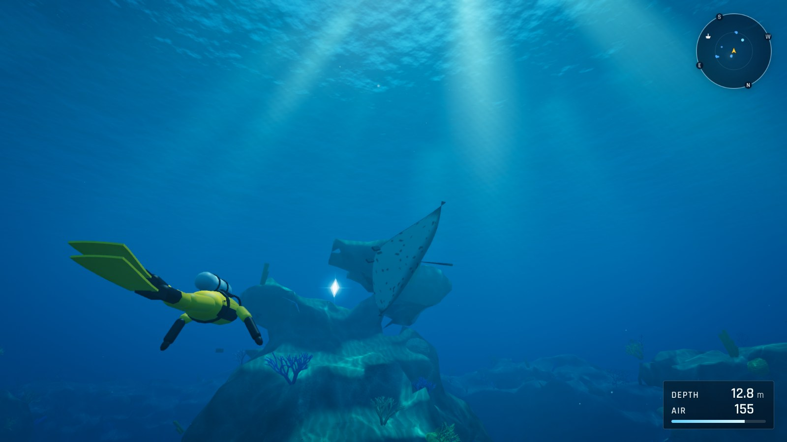
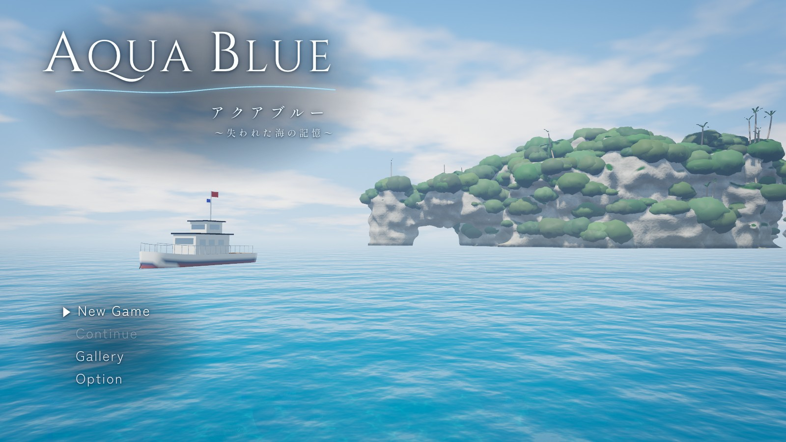
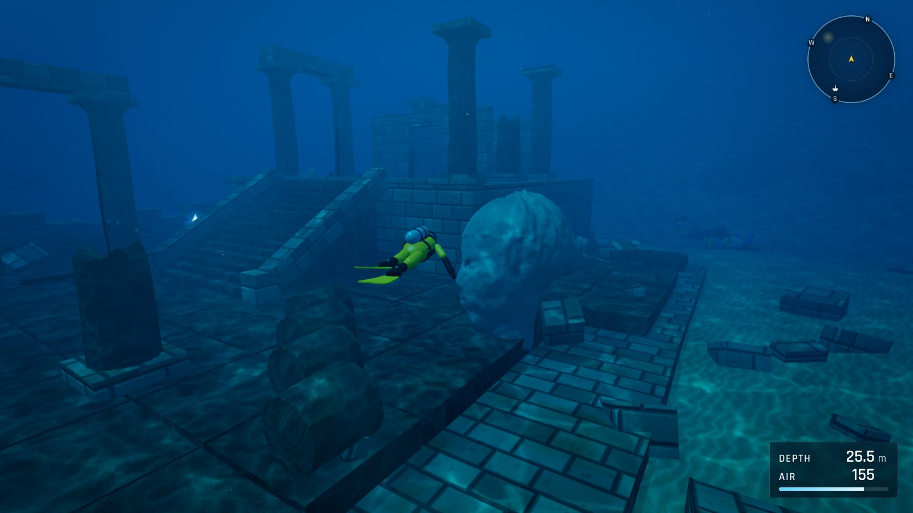
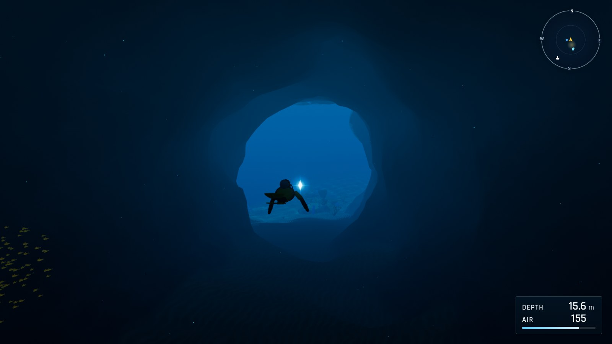
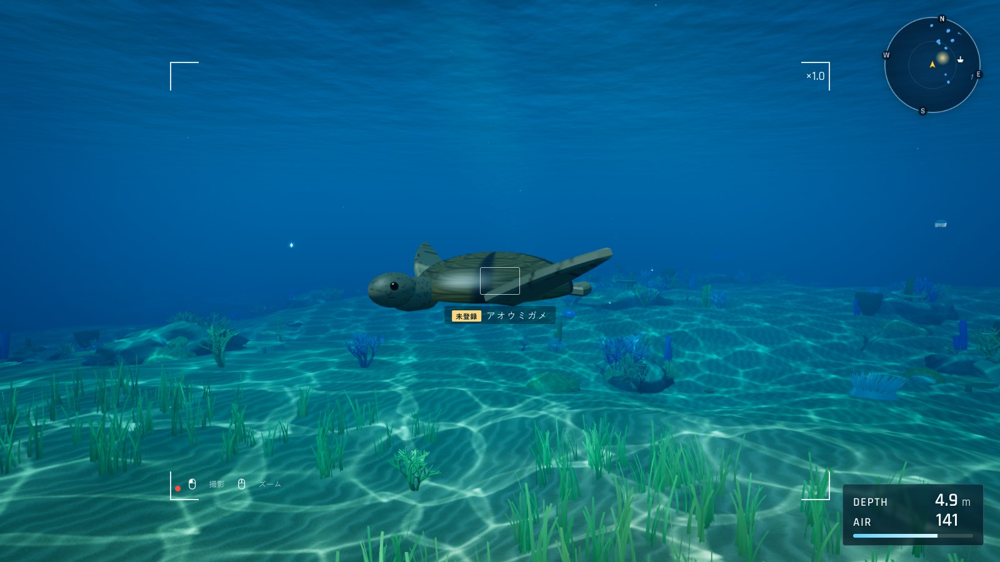
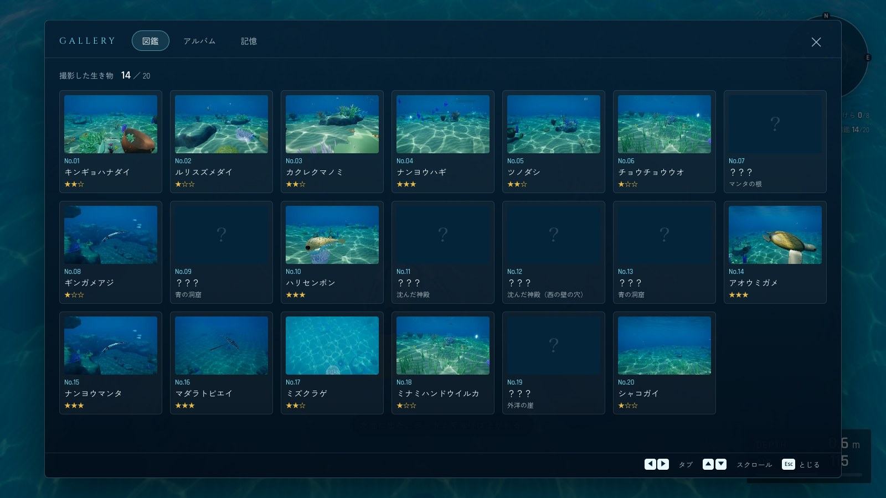
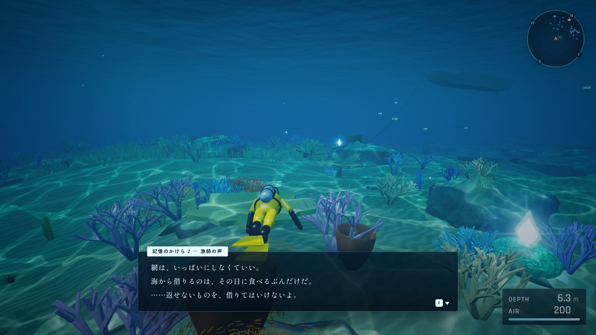

# AQUA BLUE 〜失われた海の記憶〜

青い入り江に潜って海の生き物を撮影しながら、海に沈んだ島の「記憶のかけら」を集める、ブラウザで遊べる 3D 海中探索ゲーム。

[](https://tanuu5.github.io/aqua-blue/)
[](https://www.anthropic.com/claude)
[](./LICENSE)

<p align="center">
  
</p>

<p align="center"><b><a href="https://tanuu5.github.io/aqua-blue/">▶ ブラウザで今すぐ遊ぶ</a></b>（インストール不要・PC 向け。キーボード＋マウスか、ゲームパッドで遊べます）</p>

**Claude Code × Claude Opus 5.5（MAX）** で作りました。

亡くなった祖母がうたってくれた子守唄と、遺品から出てきた古い海図。印のついた南の島の入り江へ、ボートで向かいます。
ボートから海へ潜り、サンゴの庭、マンタの泳ぐ岩の塔、沈んだ神殿、青の洞窟をめぐって、海の生き物を撮影して図鑑を埋めながら、青白く光る「記憶のかけら」を探します。
かけらに触れるたび、海に沈んだ島で暮らしていた人たちの声が少しずつ聞こえてきます。

戦いもゲームオーバーもない、のんびり遊べるゲームです。エアは深く潜るほど早く減りますが、尽きても船長がボートに引き上げてくれるだけで、集めたものは失いません。

島・海底・神殿・ボート・生き物・水面・空・BGM・効果音はすべてコードで生成していて、ゲームの中では画像・3D モデル・音声のファイルを 1 つも使っていません。

## スクリーンショット

<table>
  <tr>
    <td width="50%"><br><sub>タイトル画面。ボートの向こうに、アーチ形の岩がある島が見えます。</sub></td>
    <td width="50%"><br><sub>沈んだ神殿。列柱と大階段、崩れた内陣、海底に横たわる巨大な石像の頭。</sub></td>
  </tr>
  <tr>
    <td><br><sub>青の洞窟。暗い通路の先に、外の海の光が青く差しこむ「窓」があります。</sub></td>
    <td><br><sub>カメラを構えると、ファインダーに生き物の名前が出ます。まだ撮っていない種類には「未登録」の印。</sub></td>
  </tr>
  <tr>
    <td><br><sub>図鑑。20 種類の生き物を、写りのよさで ★1〜3 の評価つきで記録します。撮った写真はアルバムで見返せます。</sub></td>
    <td><br><sub>記憶のかけらに触れると、昔この海で暮らしていた人の言葉が浮かびます。8 つ集めると……。</sub></td>
  </tr>
</table>

画像は、すべて実際のゲーム画面です。

## 遊び方

1. **潜る**：タイトルの「New Game」で始まります。ボートから海へ飛びこんだら、自由に泳いでかまいません。
2. **撮影する**：カメラを構えて生き物を写すと、図鑑に登録されます。大きく、真ん中に、はっきり写すほど星が増えます。
3. **記憶のかけらを探す**：海のどこかで青白く光っています。近くまで来ると音が鳴り、画面に気配が知らされます。全部で 8 つ。そろうと、最後の記憶が姿を現します。
4. **エアに気をつける**：エアは深いほど・速く泳ぐほど早く減ります。水面のボートで「ボートに上がる」と補給できます。

| 操作 | キーボード・マウス | ゲームパッド |
| --- | --- | --- |
| 泳ぐ（見ている方向へ） | WASD | 左スティック |
| 見回す | マウス | 右スティック |
| 浮上 ／ 潜行 | Space ／ C | A ／ B |
| 速く泳ぐ（エアの減りが早い） | Shift | LB |
| カメラを構える（押したまま） | 右クリック | LT |
| 撮影（構えているとき） | 左クリック | RT |
| ズーム ／ カメラの距離 | ホイール | 十字キーの上下 |
| 調べる・ボートに上がる | E | X |
| 潜水ライト | F | Y |
| メニュー | Esc | メニューボタン |
| メニューの操作 | 矢印キーで選ぶ・Enter で決定・Esc でもどる | 十字キー（左スティック）で選ぶ・A で決定・B でもどる |

- 画面に出る操作の案内は、最後にさわった機器（キーボード・マウスかゲームパッドか）に合わせて自動で切り替わります。
- ゲームパッドのボタンの絵は、つないだパッドの名前から Xbox 系（タイプ1）か PlayStation 系（タイプ2）かを見分けて表示します。オプションで手動でも選べます（表示が変わるだけで、ボタンの割り当ては同じです）。
- オプションでは、BGM・効果音の音量、マウス感度、視野角、上下の反転、画質（軽い／ふつう／きれい）、操作の案内の表示を変えられます。
- 進み具合と設定はブラウザの localStorage に、撮った写真はブラウザの IndexedDB に保存されます。アルバムの写真は、拡大して画像として保存することもできます。

### 海のエリア

| エリア | 深さ | どんなところ |
| --- | --- | --- |
| サンゴの庭 | 7〜14 m | ボートの下に広がる、明るいサンゴと海草の浅瀬。カクレクマノミやウミガメに会えます。 |
| マンタの根 | 9〜27 m | 海底からそびえる岩の塔。まわりをナンヨウマンタがゆっくり回っています。 |
| 沈んだ神殿 | 25〜31 m | 列柱と大階段、崩れた内陣、巨大な石像の頭が眠る海底の遺跡。 |
| 青の洞窟 | 15〜23 m | 島の崖に開いた洞窟。奥の広間と、外の光が差しこむ「青の窓」。 |
| 外洋の崖 | 10 m〜 | 砂地が終わり、深い青へ落ちこむ崖。大きな生き物が通りかかることも。 |

## 制作について

企画・ディレクション：**たぬ**　／　開発：**Claude Code（Claude Opus 5.5・推論レベル MAX）**

たぬが用意した、存在しないゲームの画面イメージ 4 枚（タイトル画面・岩礁のマンタ・海底の遺跡・青の洞窟。AI で生成したもの）を手がかりに、実際に遊べる形にしました。画像そのものは使っていません。

- 海底は高さの関数から、島・洞窟・アーチ・岩の塔・石像の頭は距離関数（SDF）からメッシュを作っています。
- 水中の見え方は、色ごとに違う光の吸収、光の筋（ゴッドレイ）、水面の屈折から計算したコースティクス、ブルームで表しています。光の届き方と影は、起動時に一度だけ深度マップに焼きこんでいます。
- 魚の群れは群れのシミュレーション（ボイド）で泳ぎ、マンタ・ウミガメ・ウツボ・クラゲ・イルカ・ジンベエザメはそれぞれの動きを持っています。
- BGM と効果音は Web Audio でその場で合成しています。子守唄のメロディーと歌詞、物語の文章も、このゲームのための書きおろしです。

## 更新履歴

- **2026-10-04**：公開

## 開発

```bash
npm install
npm run dev      # http://127.0.0.1:5175
npm run build    # dist/ に出力
npm run preview  # ビルド結果の確認
```

### ファイル構成

```
src/
  main.js          起動と毎フレームの処理
  core/            入力、セーブ、水中の光と色の共通部分、ポストエフェクト、乱数・ノイズ
  world/           海底・島・岩の塔・神殿・ボート・サンゴ・水面・空、焼きこみ、当たり判定
  creatures/       生き物の種類と形、魚の群れ、マンタやウミガメなどの特別な生き物
  player/          ダイバーのモデルと操作・カメラ
  game/            ゲームの進行、撮影、記憶のかけら、物語の文章
  ui/              HUD・レーダー、各画面、ボタンの絵（キーボード・ゲームパッド）
  audio/           Web Audio による効果音・環境音・BGM
docs/screenshots/  README 用の画像
```

## GitHub Pages で公開する

1. リポジトリの **Settings → Pages → Build and deployment → Source** を **GitHub Actions** にします。
2. `main` に push するたびに、`.github/workflows/deploy.yml` がビルドして公開します。

`vite.config.js` の `base: './'` により、`https://<ユーザー名>.github.io/<リポジトリ名>/` のようなサブパスでもそのまま動きます。

## クレジット・ライセンス

- コード・文章：MIT License（[LICENSE](LICENSE)）© 2026 たぬ
- 3D 描画：[three.js](https://threejs.org/)（MIT License）
- フォント：Cinzel、Rajdhani、Shippori Mincho、Zen Kaku Gothic New（Google Fonts から読み込み、SIL Open Font License）
- 生き物の名前は実在の生き物のものですが、形と動きはゲーム用にデフォルメしています。
- MIT License は「Claude」の名前や商標の使用を許諾するものではありません。
